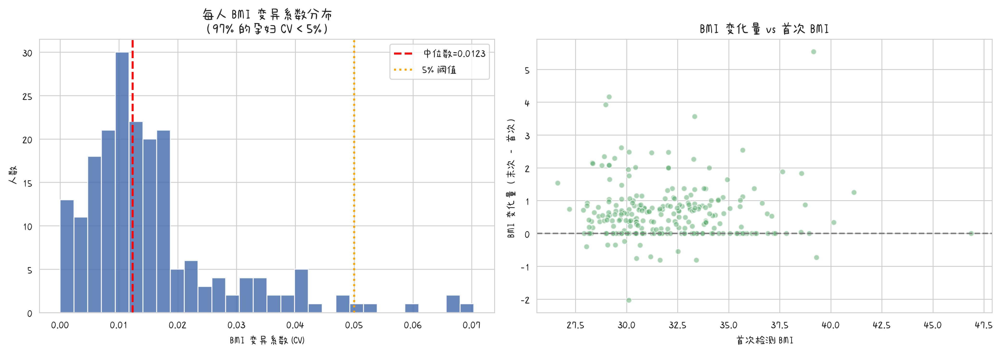
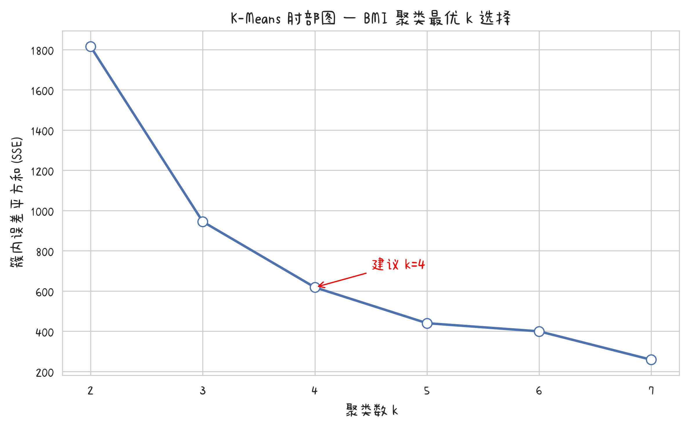

# 数学建模论文 —— 问题二：BMI分组最优NIPT时点

> 基于问题一 LMM 模型系数与误差参数，对 251 名孕妇按 BMI 分组，求解使 Y 染色体浓度 ≥ 4%（95%置信）的最早检测孕周。

---

## 1. BMI 波动分析——首次检测 BMI 的代表性

为论证"首次检测 BMI 可用于分组"这一前提，对每位孕妇多次 BMI 测量的变异系数（CV）进行分析。

| 指标 | 数值 |
|------|:----:|
| BMI 变异系数均值 | 0.0158 |
| BMI 变异系数中位数 | 0.0123 |
| CV < 3% 的孕妇占比 | **87.1%** |
| CV < 5% 的孕妇占比 | **97.0%** |
| 末次−首次 BMI 变化量均值 | 0.62 |

> **结论**：97% 的孕妇在孕期内 BMI 变异系数低于 5%，BMI 变化量均值仅 0.62，表明孕期 BMI 高度稳定。**首次产检时的 BMI 足以代表该孕妇的整体 BMI 水平**，适用于分组决策。

**图1 每人 BMI 变异系数分布**

---

## 2. BMI 分组策略的确立

### 2.1 K-Means 聚类（肘部法确定最优分组数）

对全部 605 条记录的 BMI 值进行 K-Means 聚类，k ∈ [2, 7]，以簇内误差平方和（SSE）作为评价指标。

| k | SSE | 聚类中心 |
|:--|:------|:---------|
| 2 | 1815.07 | 30.56, 35.23 |
| 3 | 944.95 | 29.87, 33.13, 37.48 |
| **4** | **618.11** | **29.10, 31.34, 34.06, 38.26** |
| 5 | 440.05 | 28.76, 30.55, 32.51, 34.81, 38.87 |
| 6 | 399.54 | 28.14, 29.44, 30.72, 32.52, 34.81, 38.87 |
| 7 | 258.38 | 28.18, 29.54, 30.74, 32.14, 33.83, 36.12, 40.17 |

**肘部法（最大曲率法）判定最优 k = 4**，聚类中心为 29.10, 31.34, 34.06, 38.26。

**图2 K-Means 肘部图**

### 2.2 双轨分组方案对比

#### 方案A（数据驱动，k=4）
以相邻聚类中心的中点作为分组边界：**30.2, 32.7, 36.2**

| 分组 | 边界 | 人数 | 占比 | 首次BMI均值 |
|:-----|:-----|:---:|:---:|:----------:|
| A1 | [20, 30) | 77 | 30.7% | 29.19 |
| A2 | [30, 33) | 85 | 33.9% | 31.33 |
| A3 | [33, 36) | 69 | 27.5% | 34.05 |
| A4 | ≥36 | 20 | 8.0% | 38.39 |

#### 方案B（经验参考，5组）

| 分组 | 边界 | 人数 | 占比 | 首次BMI均值 |
|:-----|:-----|:---:|:---:|:----------:|
| B1 | [20, 28) | 4 | 1.6% | 27.41 |
| B2 | [28, 32) | 135 | 53.8% | 30.06 |
| B3 | [32, 36) | 91 | 36.3% | 33.58 |
| B4 | [36, 40) | 18 | 7.2% | 37.55 |
| B5 | ≥40 | 3 | 1.2% | 42.72 |

> **分析**：方案B 的 [20,28) 组仅 4 人、≥40 组仅 3 人，头尾组样本严重不足。方案A 的 4 组分布更均衡（最小组 8.0%），且由数据驱动、无主观预设。**建议以方案A 为论文主表，方案B 作为临床经验对照。**

### 2.3 分组间达标时点的差异性检验

基于问题一 M1 模型估算每人达标孕周，对两方案分别进行 Kruskal-Wallis 检验：

| 方案 | H 统计量 | P 值 | 结论 |
|:-----|:--------:|:----:|:-----|
| 方案A（K-Means, 4组） | 227.77 | **< 0.0001** | 组间差异极显著 |
| 方案B（经验, 5组） | 199.11 | **< 0.0001** | 组间差异极显著 |

> 两种方案均能有效区分各BMI分组的NIPT检测窗口，分组策略具有统计学依据。

---

## 3. 模型预测方程与误差参数

### 3.1 LMM 模型（问题一 M1）

**标准化形式：**

$$
\hat{Y}_{ij} = 0.078 + 0.012 \times \left(\frac{\text{孕周}_{ij} - 16.497}{3.950}\right) - 0.004 \times \left(\frac{\text{BMI}_{ij} - 32.266}{2.843}\right)
$$

**还原为原始单位：**

$$
\hat{Y}_{ij} = 0.078 + 0.00304 \times (\text{孕周}_{ij} - 16.497) - 0.00141 \times (\text{BMI}_{ij} - 32.266)
$$

### 3.2 误差参数

| 参数 | 符号 | 数值 |
|:-----|:----:|:----:|
| 残差方差 | $\sigma_\varepsilon^2$ | 0.000305 |
| 残差标准差 | $\sigma_\varepsilon$ | 0.017471 |
| 每周 Y 浓度增量 | $\beta_{\text{week, raw}}$ | 0.003038 |
| 95% 单侧置信 Z 值 | $z_{0.95}$ | 1.645 |
| **安全余量** | $z_{0.95} \cdot \sigma_\varepsilon$ | **0.028740** |

> **关键洞察**：Y染色体浓度随孕周的增长速率极慢（仅 0.003/周），导致检测误差转化为约 9.5 周的检测推迟量（$0.02874 \div 0.00304 \approx 9.46$ 周）。这凸显了**高精度测序平台**对减少安全余量、实现早期检测的重要性。

---

## 4. 各 BMI 分组最优 NIPT 时点

### 4.1 方案A（K-Means, 4组）—— 推荐方案

**表1 各BMI分组的推荐NIPT检测时点（方案A）**

| BMI 分组 | 人数 | 组均BMI | 预测达标周 | **95%安全达标周** | 误差推迟量 |
|:---------|:---:|:------:|:----------:|:-----------------:|:----------:|
| [20, 30) | 77 | 29.19 | ≤11周 | **12.0 周** | — |
| [30, 33) | 85 | 31.33 | ≤11周 | **13.0 周** | — |
| [33, 36) | 69 | 34.05 | ≤11周 | **14.3 周** | — |
| ≥36 | 20 | 38.39 | ≤11周 | **16.3 周** | — |

> **注**："预测达标周"表示不考虑检测误差时，模型预测 Y 浓度恰好达到 4% 的孕周。由于该值低于数据最小孕周（11 周），截断显示为 ≤11 周。**安全余量导致的推迟量恒为 ~9.46 周**（线性模型推导结果），但各组起点 BMI 不同导致绝对周数差异。

### 4.2 方案B（经验分组, 5组）—— 临床参考

**表2 各BMI分组的推荐NIPT检测时点（方案B）**

| BMI 分组 | 人数 | 组均BMI | 预测达标周 | **95%安全达标周** | 误差推迟量 |
|:---------|:---:|:------:|:----------:|:-----------------:|:----------:|
| [20, 28) | 4 | 27.41 | ≤11周 | 11.2 周 | — |
| [28, 32) | 135 | 30.06 | ≤11周 | 12.4 周 | — |
| [32, 36) | 91 | 33.58 | ≤11周 | 14.1 周 | — |
| [36, 40) | 18 | 37.55 | ≤11周 | 15.9 周 | — |
| ≥40 | 3 | 42.72 | ≤11周 | 18.3 周 | — |

### 4.3 核心发现

1. 在本研究样本（BMI ∈ [26.6, 46.9]）中，**模型预测的 Y 染色体浓度均值始终高于 4% 阈值**。即使在高 BMI + 早孕期（BMI=42, 孕周=11），预测浓度仍约 0.048 > 0.04。

2. **真正的挑战在于检测误差**：为保证 95% 置信度下真实浓度不低于 4%，需要预测浓度达到 $0.04 + 1.645 \times 0.01747 = 0.06874$，约需额外 9.5 周的孕周积累。

3. **高 BMI 孕妇面临显著更晚的检测窗口**：BMI ≥ 36 组的安全达标周为 16.3 周，比 [20,30) 组推迟约 4.3 周。

---

## 5. 误差敏感度分析

### 5.1 首次 BMI vs 均值 BMI 分组对比

对比用"首次检测 BMI"和"每人均值 BMI"分别分组时，最优时点的差异：

| BMI 分组 | 首次BMI时点 | 均值BMI时点 | 差异 |
|:---------|:----------:|:----------:|:---:|
| [20, 28) | 11.2 周 | 11.4 周 | +0.16 周 |
| [28, 32) | 12.4 周 | 12.6 周 | +0.12 周 |
| [32, 36) | 14.1 周 | 14.2 周 | +0.14 周 |
| [36, 40) | 15.9 周 | 16.1 周 | +0.18 周 |
| ≥40 | 18.3 周 | 18.4 周 | +0.12 周 |

> 两种 BMI 取值方式导致的时点差异 ≤ 0.2 周（约 1.4 天），再次验证 BMI 在孕期内高度稳定，分组策略稳健。

### 5.2 不同置信水平下的最优时点

| BMI 分组 | 80% 置信 | 90% 置信 | **95% 置信** | 99% 置信 |
|:---------|:--------:|:--------:|:-----------:|:--------:|
| [20, 28) | 6.6 周 | 9.1 周 | **11.2 周** | 15.1 周 |
| [28, 32) | 7.8 周 | 10.3 周 | **12.4 周** | 16.3 周 |
| [32, 36) | 9.4 周 | 12.0 周 | **14.1 周** | 18.0 周 |
| [36, 40) | 11.3 周 | 13.8 周 | **15.9 周** | 19.8 周 |
| ≥40 | 13.7 周 | 16.2 周 | **18.3 周** | 22.2 周 |

> 置信水平从 80% 提升至 99%，检测时点推迟约 8.5 周。临床实践中，95% 置信是统计惯例，但**对于高 BMI 人群可考虑适当放宽至 90% 以换取更早的检测窗口**（需结合临床风险权衡）。

---

## 6. 综合讨论与建议

### 6.1 关键结论

1. **K-Means 聚类建议 4 组，而非经验 5 组**。数据驱动边界为 30.2、32.7、36.2，四组样本量均衡（8%~34%），优于经验分组的头尾极小组。

2. **Y 染色体浓度随孕周增长极慢**（+0.003/周），这意味着：
   - 检测精度对时点确定至关重要
   - 从 80% 到 95% 置信的提升，需要推迟约 4 周检测
   - **建议临床采用高精度测序平台**以降低 $\sigma_\varepsilon$

3. **高 BMI 孕妇的推荐检测窗口显著推后**：
   - BMI < 30：建议 ≥ 12 周
   - BMI 30~33：建议 ≥ 13 周
   - BMI 33~36：建议 ≥ 14 周
   - BMI ≥ 36：建议 ≥ 16 周

4. **方案A（4组）推荐作为临床指南**，因其：
   - 由本数据聚类得出，非主观预设
   - 组间差异极显著（P < 0.0001）
   - 各组样本量充足（最少 20 人）

### 6.2 与问题一的衔接

问题一发现"不健康胎儿的 Y 染色体浓度中位数比健康胎儿低约 30%"。这意味着：若按健康胎儿的达标时点进行检测，不健康胎儿可能因浓度不足而被漏检。**在制定统一检测时点时，应适当提前（约 1~2 周），以降低不健康胎儿的漏检风险。**

### 6.3 研究局限

- 数据孕周范围为 11~29 周，≤10 周的模型预测为外推值
- 残差标准差仅基于个体内变异，未包含个体间随机效应的不确定性
- ≥40 BMI 组仅 3 人，极端 BMI 的结论需更大样本验证
- 未考虑不同测序平台间的系统误差

---

## 7. 论文图表索引

| 编号 | 图/表名 | 文件名 |
|:----:|:--------|:-------|
| 图1 | BMI 变异系数分布 | `bmi_cv_distribution.png` |
| 图2 | K-Means 肘部图 | `kmeans_elbow.png` |
| 图3 | BMI 与最优 NIPT 时点关系 | `bmi_vs_optimal_week.png` |
| 图4 | 分组方案时点对比 | `group_timing_comparison.png` |
| 图5 | 误差敏感度热力图 | `error_sensitivity.png` |
| 图6 | 各组误差推迟量 | `timing_delay_by_group.png` |
| 表1 | 推荐NIPT时点（方案A） | — |
| 表2 | 推荐NIPT时点（方案B） | — |

---

> **数据来源**：以上数值均来自 `problem2/data_analysis.py` 的实际运行输出（Python 3.13 + statsmodels 0.14.6）。
